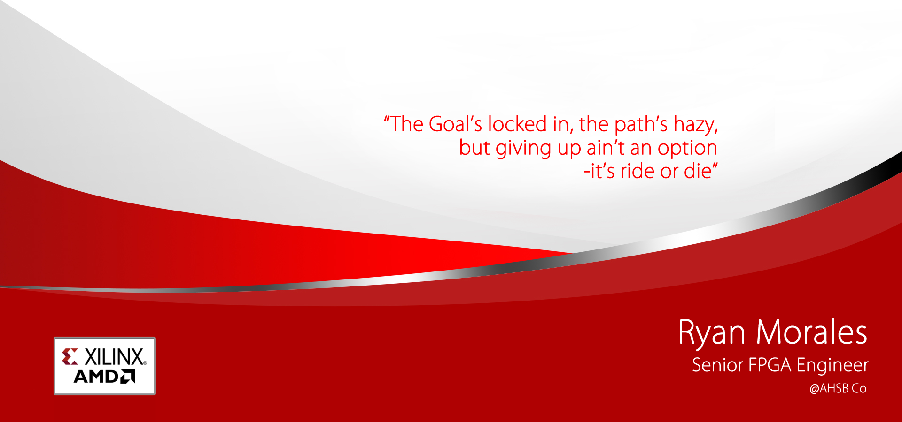

**Ryan Morales**

_Chief Technology Officer, AHSB Co._

As the CTO of AHSB Co., I oversee the strategic and technical direction of our company, focusing on cutting-edge solutions in the fields of **AI**, **IoT**, and **edge computing**. With a strong background in **embedded systems**, **wireless communication**, and **mobile app** development, I am passionate about developing **ultra-efficient**, **scalable**, and **secure** technologies.

My expertise includes working with real-time operating systems (**RTOS**), **FPGA** development, and **low-power IoT devices**, integrating industry-leading platforms such as **AWS IoT** and **Azure IoT**. I specialize in designing systems that utilize wireless technologies like **Bluetooth 5.0**, **LoRaWAN**, **LTE/NB-IoT**, **Zigbee**, **UWB**, and **SDR**. Additionally, I am adept at developing mobile solutions using **Flutter**, **React Native**, and **Android** for seamless user experiences.

At AHSB Co., I lead a dedicated team in pushing the boundaries of edge computing, leveraging advanced techniques such as **digital signal processing (DSP)**, **computer vision**, **TensorFlow Lite**, and **edge AI** to provide real-time insights and solutions.

1. **Embedded Systems**  
   - ESP32, STM32, nRF, FPGA  
   - Bare-metal programming  
   - RTOS (Real-Time Operating Systems)  

2. **Mobile Development**  
   - Flutter  
   - React Native  
   - Android  

3. **IoT and Wireless Technologies**  
   - Bluetooth 5.0  
   - Wi-Fi  
   - LoRaWAN  
   - LTE/NB-IoT  
   - Zigbee  
   - UWB (Ultra-Wideband)  
   - SDR (Software-Defined Radio)  
   - AWS IoT, Azure IoT

4. **User Interface Development**  
   - LVGL (Light and Versatile Graphics Library)  

5. **Edge Computing**  
   - Digital signal processing (DSP)  
   - Computer vision  
   - TensorFlow Lite  
   - Edge AI  

6. **FPGA Development**  
   - High-speed embedded systems  
   - Custom hardware design  

7. **Cloud and Backend Systems**  
   - Integration with AWS IoT and Azure IoT  

