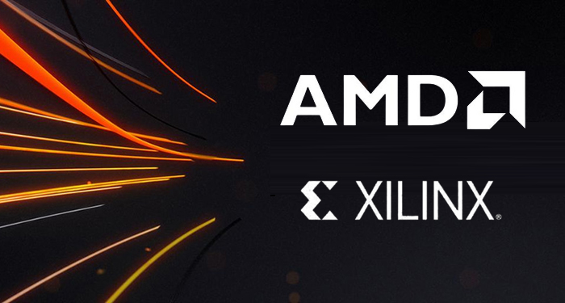

  

    I’m a Senior FPGA Engineer with a strong passion for hardware design, FPGA programming, and embedded systems. My work focuses on creating and optimizing advanced hardware architectures, with a special interest in <strong>Xilinx technology</strong>. I’m also dedicated to finding sustainable solutions for a greener world.
  

  

My career started in web development and cloud computing, then moved into kernel development. Eventually, I found my true passion in hardware and firmware engineering, where I now enjoy working with AI and embedded systems. This blend of skills allows me to connect hardware and software effectively, contributing to high-performance projects that require precision and specialized knowledge.

I thrive on challenges and love diving into new technologies, often dedicating myself fully to mastering them. Whether it’s working on cutting-edge systems or contributing to open-source projects, I’m always eager to learn and innovate.

- 💻 **Languages:** VHDL, Verilog, C, C++, Python, and more.
- 📚 **Currently Learning:** Advanced FPGA architectures and AI hardware accelerators.
- 💡 **Interests:** Hardware design, low-level programming, hardware-software co-design, and technology trends.

